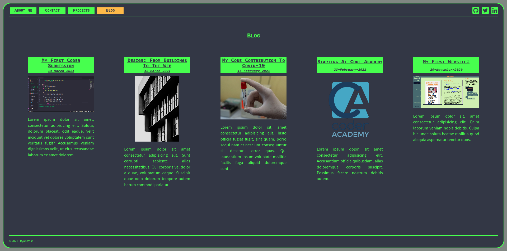

# Portfolio Site

This project was built as a part of the Coder Academy fast track to web development course.
The aim is to produce a portfolio site with which we can showcase our work as we progress and to help reinforce our knowledge of HTML and CSS before moving onto other languages.

## Deployment

The site can either be opened locally using the files found in the `src` directory, or found deployed on [Netlify at https://ryanjwise.netlify.app/](https://ryanjwise.netlify.app/)

## About

### Functionality / features

The site is designed to showcase existing and future work with simple access to:

- Information About Me
- An expansible list of highlight projects
- An expansible index of blog posts
- Contact Details/ or methods to get in touch with me

It is designed to be mobile first, and responsive across mobile, tablet and desktop devices.

It uses flexbox and some grids to ensure that content can be added to various arrays without additional styling requirements.

- In some instances placeholder images have been used instead of screenshots. When this is the case they have been sourced using [Unsplashed.com](https://unsplash.com/), I do not own the rights to these images.

### Sitemap

### Target audience

Potential employers that may be looking to engage a junior developer and IT professional.

It can be assumed that they have:

- Technical knowledge in the field of information technology
- A high expectation of professionalism and work ethic.

### Tech stack (e.g. html, css, deployment platform, etc)

Deployed on [Netlify](https://www.netlify.com/), using a front end stack including:

- HTML
- [SCSS](https://sass-lang.com/)

### Screenshots

#### Home

##### Mobile

##### Desktop

#### Projects

##### Mobile

##### Desktop

#### Contact

##### Mobile

##### Desktop

#### Blog

##### Mobile

##### Desktop

#### Blogpost

##### Mobile

##### Desktop

## Directory Map

- root
  - gitlog.txt
  - README.md
  - .gitignore
  - ./docs/
    - All resources referenced by the README.md file
	- .png/jpg/md etc
  - ./ppt/
    - Slide Deck.whatever
    - Slide Deck.pdf
  - ./src/
    - Source code
    - *.html
    - /blog
      - YYYY-MM-DD.html
      - /blog-resources
        - /YYYY-MM
          - imgs etc
    - /styles
      - .css files
    - /resources
      - img's
      - etc
    - /build
      - global.scss (Holds variables Fixins and global element styling)
      - styles.scss (Holds import statements for font and all other .scss files)
      - /componants
        - .scss (Holds all scss files for componant styling)
      - /pages
        - .scss (Holds all scss files for page specific overrides)
## To-Do

- Make Header and footer fixed elements
- make content height = screen height
- Animate Header